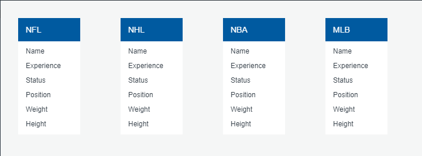

# Professional-Athlete-Career-Lifetimes
Final Project Repo

Deliverable 1:

Our selected topic is on athletes and if we can determine the length of a professional athlete's career based on external factors, including the sport they play, their position, height, weight, and more. 

We selected this topic because we think there is a lot of potential knowledge in the comparison of career length between each sport, position, and body type. 

Our data source for Deliverable 1 is a dataset of NFL Statistics found on Kaggle (https://www.kaggle.com/kendallgillies/nflstatistics). The dataset contains data of players past and up to 2017. We did intial cleaning of the data in Excel, to remove the extra characters from the Experience column to reflect just the number of seasons. Something of note is that only active players have data on their position, and only retired players have data on their Years Played. The dataset can be found in the Resources folder. 

With this project we hope to find out which athletes from the Big 4 Sports Leagues have the longest careers, and to further break down and compare that data by position and body type. Other potential external factors include which college the player attended, their place of origin, and starting age. 

Database ERD:

Machine Learning Model:

# Communication Protocols

Our group consists of 5 people (Shihab Humayun, Peter Nielson, Matthew DeYoung, Alyssa Allende Motz and Eric Williams). Primary contact will be maintained through Slack and/or Zoom. Additional contact information follows below:

__Shihab__ \
Email: shihab_humayun@yahoo.com\
Cell: (321) 888 - 9978

__Peter__ \
Email: petenielsen93@gmail.com\
Cell: (407) 937-8174

__Matthew__ \
Email: deyoungmatthewd@gmail.com\
Cell: (407) 405-0651

__Alyssa__ \
Email: aamotz001@gmail.com \
Cell: (720) 469 - 4500

__Eric__ \
Email: eric.williamscait@gmail.com \
Cell: (321) 274-6611

## Communication Standards
The following guidelines have been agreed upon:

* In order to maintain communication throughout the working period, we plan to meet 3 times a week: during the assigned group time in Tuesday/Thursday lectures, and once on Saturday (time will be agreed upon the Thursday before). 
* We anticipate an initial total of approximately 2-3 hours per week in discussion with the entire group present, with more time assigned as required (to be decided upon as a group). As well, group members working together will interface as needed, with communication times set between the relevant members. The entire group need not be alerted to meetings between individuals. 
* It is understandable if a group member needs to be absent for a particular meeting, however it is expected that they will put forth best efforts to get back up to date and minimize the number of absences. It is preferred if absences are communicated at least 24 hours before hand.

## Project Roles

Our group has decided on the following division of work:

__Square Role:__ Alyssa

__Triangle Role:__ Shihab and Peter

__Circle Role:__ Matthew

__X Role:__ Eric and Alysssa

